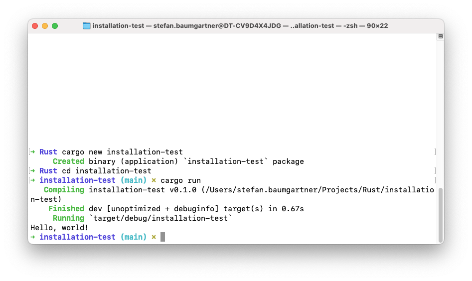
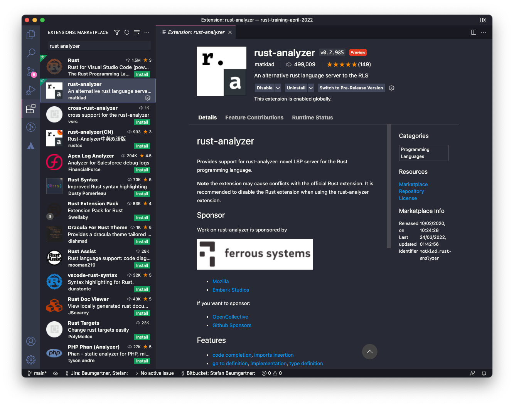

# Rust Fundamentals Training April 2022

Hello everyone!

This GitHub repo will contain all the examples and workshops files we create during our time together.

## Install Rust

[Rustup](https://rustup.rs) provides you with all the software to compile and run Rust applications, e.g.

1. Cargo - build tool and package manager
2. `rustfmt` - Auto-formatting tool for Rust code
3. `clippy` - Linting for common mistakes

[and many more](https://rust-lang.github.io/rustup-components-history/). *Rustup* also allows you to install different compile targets and multiple toolchains, as well as keeping your toolchains up to date.

After installing, you should have a set of new command line tools available. 

### Verify your Rust installation:

1. Open a Terminal/Shell/Command Line of your choice
2. Navigate to a folder you want to use for your Rust projects
3. Enter

```bash
$ cargo new installation-test
```

4. Cargo will create a "Hello World" application for you. Enter the newly created directory

```bash
$ cd installation-test
```

5. Build and run

```bash
$ cargo run
```

If you see compile information and `Hello, world!` printed out on your command line, you are ready to go!



## Recommended Editor

During the workshop, we will use [Visual Studio Code](https://code.visualstudio.com/) as editor. It's free, fast and very extensible. Making yourself familiar with VS Code is highly recommended.

However, working with VS Code is not required. If you have a preferred editor with Rust support you're more productive with, please feel free to use whatever you like. What we highyly recommend though, is checking if your editor has support for [Rust analyzer](https://rust-analyzer.github.io/).

## Recommended VS Code Extensions

To work effeciently, please install a couple of extensions that help you developing Rust. *Note*: Please don't install the recommendend Rust extension. It's outdated and the community decided to move to other tools.

You can search and install VS Code extensions through the menu on the side



We recommend the following extensions:

- [rust-analyzer](https://marketplace.visualstudio.com/items?itemName=matklad.rust-analyzer). This is the main extension for Rust development, with the best language support available. *Note*: This extension is also available for other IDEs and editors, check out [their website](https://rust-analyzer.github.io/)

- [crates](https://marketplace.visualstudio.com/items?itemName=serayuzgur.crates). This extension helps installing dependencies from crates.io

- [Better TOML](https://marketplace.visualstudio.com/items?itemName=bungcip.better-toml). TOML is the format that the dependency manager Cargo uses to manage dependencies. This extension helps formatting and editing TOML files

- [CodeLLDB](https://marketplace.visualstudio.com/items?itemName=vadimcn.vscode-lldb). All Rust code is compiled against LLVM. This extension helps debugging LLVM code inside VS Code

## Folder structure

- [`examples`](./examples/) - All the examples we do together in our workshop
- [`exercises`](./exercises/) - Homework and workshop exercises complete with tests
- [`solutions`](./solutions/) - Solutions to homework and workshop exercises as a reference for you
- [`assets`](./assets/) - Images, etc. for the documentation files, nothing that important.
